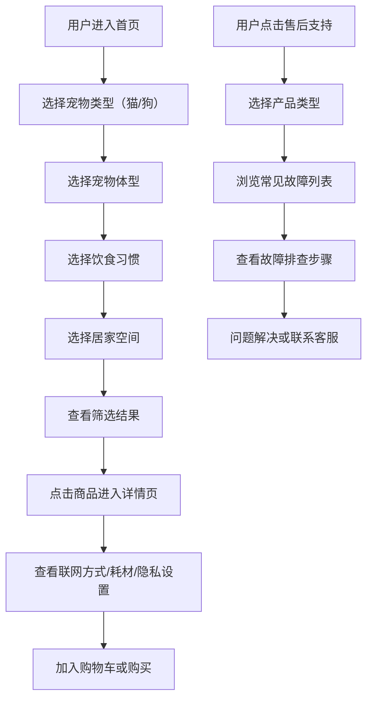

## 1. 产品概述

宠物智能用品电商平台，为养猫养狗用户提供自动喂食器、饮水机、智能摄像头等产品，支持按宠物体型、饮食习惯和居家空间精准筛选，商品详情强调联网方式、耗材说明和隐私设置，售后区提供实用的故障排查指南。

- 目标用户：养猫养狗的现代家庭用户，关注宠物健康与生活品质
- 市场价值：填补宠物智能用品垂直电商领域的信息空白，通过专业筛选和透明售后提升购买决策效率

## 2. 核心功能

### 2.1 功能模块

1. **首页**：导航栏、品牌横幅、智能筛选区、分类商品展示、售后入口
2. **商品列表页**：多维度筛选、商品卡片展示、排序功能
3. **商品详情页**：产品大图、规格参数、联网方式说明、耗材信息、隐私设置、购买入口
4. **售后支持页**：常见故障分类、故障排查步骤、联系客服入口

### 2.3 页面详情

| 页面名称 | 模块名称 | 功能描述 |
|----------|----------|----------|
| 首页 | 智能筛选区 | 按宠物类型（猫/狗）、体型（小/中/大）、饮食习惯、居家空间筛选商品 |
| 首页 | 分类商品展示 | 自动喂食器、饮水机、智能摄像头三大分类展示 |
| 首页 | 售后支持入口 | 引导用户查看常见故障和售后支持 |
| 商品列表页 | 多维度筛选面板 | 宠物类型、体型、饮食习惯、居住空间、联网方式、价格区间筛选 |
| 商品列表页 | 商品卡片 | 产品缩略图、名称、价格、核心卖点标签 |
| 商品详情页 | 产品展示区 | 轮播大图、产品名称、价格、核心参数 |
| 商品详情页 | 联网方式说明 | Wi-Fi/蓝牙/Zigbee 等连接方式图文说明，配置步骤指引 |
| 商品详情页 | 耗材信息 | 滤芯、食盆、干燥剂等耗材型号、更换周期、购买链接 |
| 商品详情页 | 隐私设置说明 | 摄像头权限、数据加密、本地存储、云端隐私保护说明 |
| 售后支持页 | 常见故障分类 | 按产品类型分类展示故障列表 |
| 售后支持页 | 故障排查步骤 | 分步骤图文排查指引，避免营销图堆砌 |
| 售后支持页 | 联系客服 | 在线客服入口和服务时间说明 |

## 3. 核心流程

## 4. 用户界面设计

### 4.1 设计风格
- **主色调**：暖橙 (#FF8C42) + 森林绿 (#2D6A4F)，传递温暖与自然的宠物友好氛围
- **辅助色**：米白 (#FFF9F0) 背景、深灰 (#333) 文字
- **按钮风格**：圆角胶囊按钮，主按钮为暖橙渐变，悬浮时有上浮微动画
- **字体**：展示字体使用 Playfair Display（优雅标题），正文字体使用 LXGW WenKai（中文可读性）
- **布局风格**：卡片式布局，大量圆角，柔和阴影，空间留白充足
- **图标风格**：线性卡通风格图标，搭配柔和填充色

### 4.2 页面设计概述

| 页面名称 | 模块名称 | UI 元素 |
|----------|----------|---------|
| 首页 | Hero 横幅 | 毛宠物与智能产品互动场景图，大标题 + 副标题 + CTA 按钮 |
| 首页 | 智能筛选区 | 卡片式筛选器，每一步选择有进度指示，图标+文字组合 |
| 首页 | 分类商品展示 | 三栏卡片布局，悬停放大动画，快速查看按钮 |
| 商品列表页 | 筛选面板 | 左侧吸顶筛选栏，可折叠分类，选中状态高亮 |
| 商品详情页 | 技术说明区 | 三标签页切换（联网/耗材/隐私），每区含图标+详细文字说明 |
| 售后支持页 | 故障排查区 | 手风琴折叠面板，每步有编号指示和实景说明图 |

### 4.3 响应式设计
- 桌面优先设计，自适应适配平板和移动端
- 移动端：筛选器转为顶部下拉，商品列表单列展示
- 触摸优化：按钮最小尺寸 44px，手势滑动浏览产品图

