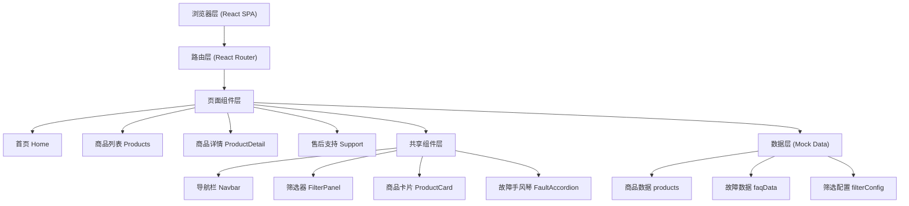

## 1. 架构设计



## 2. 技术描述

- **前端框架**：React 18 (使用 Hooks: useState, useEffect, useContext)
- **构建工具**：Vite 5
- **样式方案**：TailwindCSS 3 + CSS Variables 主题系统
- **路由管理**：React Router v6
- **图标库**：Lucide React（轻量级线性图标）
- **后端**：无（纯前端 SPA，使用本地 Mock 数据）
- **数据存储**：无数据库，所有数据以 JS 对象形式硬编码在 data 目录

## 3. 路由定义

| 路由路径 | 页面组件 | 用途 |
|----------|----------|------|
| `/` | Home | 首页，含智能筛选、分类展示、售后入口 |
| `/products` | Products | 商品列表页，多维度筛选商品 |
| `/products/:id` | ProductDetail | 商品详情页，含联网/耗材/隐私说明 |
| `/support` | Support | 售后支持页，常见故障排查 |

## 4. 数据模型（Mock 数据结构）

### 4.1 商品数据 (Product)
```typescript
interface Product {
  id: string;
  name: string;
  category: 'feeder' | 'water' | 'camera';
  price: number;
  originalPrice?: number;
  images: string[];
  tags: string[];
  description: string;
  
  // 筛选维度
  petType: ('cat' | 'dog')[];
  petSize: ('small' | 'medium' | 'large')[];
  dietHabit: ('regular' | 'frequent' | 'diet')[];
  livingSpace: ('apartment' | 'house' | 'studio')[];
  
  // 详情技术参数
  connectivity: {
    type: 'wifi' | 'bluetooth' | 'zigbee';
    description: string;
    setupSteps: string[];
  };
  consumables: {
    name: string;
    model: string;
    replaceCycle: string;
    price: number;
  }[];
  privacy: {
    encryption: string;
    localStorage: boolean;
    cloudStorage: boolean;
    permissions: string[];
  };
  specs: Record<string, string>;
}
```

### 4.2 故障数据 (FaultItem)
```typescript
interface FaultItem {
  id: string;
  category: 'feeder' | 'water' | 'camera';
  title: string;
  severity: 'low' | 'medium' | 'high';
  steps: {
    step: number;
    description: string;
  }[];
  relatedProducts?: string[];
}
```

## 5. 目录结构

```
src/
├── components/          # 共享组件
│   ├── Navbar.tsx
│   ├── Footer.tsx
│   ├── ProductCard.tsx
│   ├── FilterPanel.tsx
│   ├── SmartFilter.tsx
│   └── FaultAccordion.tsx
├── pages/               # 页面组件
│   ├── Home.tsx
│   ├── Products.tsx
│   ├── ProductDetail.tsx
│   └── Support.tsx
├── data/                # Mock 数据
│   ├── products.ts
│   ├── faults.ts
│   └── filterConfig.ts
├── types/               # TypeScript 类型
│   └── index.ts
├── App.tsx              # 路由配置
├── main.tsx
└── index.css            # TailwindCSS 入口和主题变量
```

